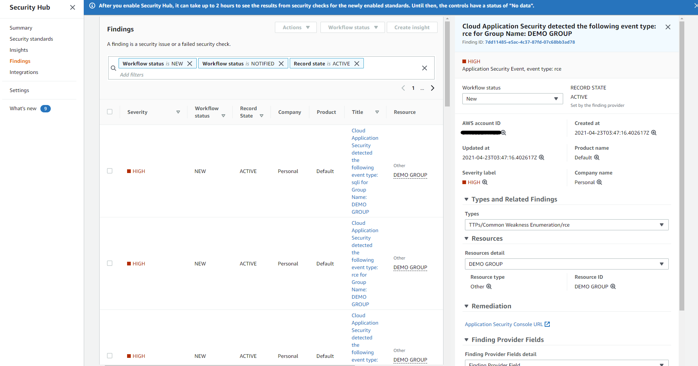

# Cloud-One-Application-Security-SNS-to-Security-Hub
## Description
This AWS SAM (Serverless Application Model) deployment configures the required resources to send Trend Micro's Cloud One Application Security events to AWS Security Hub.

## Prerequisites
1. **Install AWS SAM CLI**
    - Visit [Installing the AWS SAM CLI](https://docs.aws.amazon.com/serverless-application-model/latest/developerguide/serverless-sam-cli-install.html) for detailed instructions for your Operating System.
    - Configure your [AWS Credentials](https://docs.aws.amazon.com/serverless-application-model/latest/developerguide/serverless-getting-started-set-up-credentials.html) for use with AWS SAM CLI.
2. **Configure Application Security SNS integration to obtain the external ID value**
    - Access to the Cloud One - Application Security console with administrative privileges to create a new integration.

## Installation

### From AWS SAM CLI - Option 1 - New Application Security SNS Integration

1. Open the Application Security Console - Select Integrations - Select Amazon SNS, select and copy the `External ID` value as this will be needed when entering the parameters. Leave the rest of the values blank for now, details for these values will be available after completing the next steps.
2. Clone this repository from [Github](https://github.com/TomRyan-321/Cloud-One-Application-Security-SNS-to-Security-Hub).
3. Using your terminal navigate to the `Cloud-One-Application-Security-SNS-to-Security-Hub` folder contained within the above cloned repository. Example: `User@Host:cd ~/Cloud-One-Application-Security-SNS-to-Security-Hub/`
4. Deploy the SAM template in guided mode. Example: `sam deploy --guided`
5. When prompted for `Parameter ExternalID`, paste in the value you copied in Step 1.
6. When prompted for `Parameter UseExistingSNSTopic` leave the default value of `false`.
7. When prompted for `Parameter ExistingSNSTopicARN` leave the default value of `None`.
6. Select `Yes` by press `Y` to the following prompts: `Confirm changes before deploying`, `Allow SAM CLI IAM role creation`
7. Optionally save the above parameters to a configuration file when promtped.
8. Review the resources to be created/updated and select `Yes` by pressing `Y` to deploy the solution.
9. Once deployment finishes, it output will provide the rest of the values required for finishing the integration within the Application Security console.

### From AWS SAM CLI - Option 2 - Existing Application Security SNS Integration

1. Clone this repository from [Github](https://github.com/TomRyan-321/Cloud-One-Application-Security-SNS-to-Security-Hub).
2. Using your terminal navigate to the `Cloud-One-Application-Security-SNS-to-Security-Hub` folder contained within the above cloned repository. Example: `User@Host:cd ~/Cloud-One-Application-Security-SNS-to-Security-Hub/`
3. Deploy the SAM template in guided mode. Example: `sam deploy --guided`
4. When prompted for `Parameter ExternalID`, leave the value blank or put in any dummy value.
5. When prompted for `Parameter UseExistingSNSTopic` set the value to `true`.
6. When prompted for `Parameter ExistingSNSTopicARN` input the ARN of your existing Cloud One Application Security SNS Topic.
7. Select `Yes` by press `Y` to the following prompts: `Confirm changes before deploying`, `Allow SAM CLI IAM role creation`
8. Optionally save the above parameters to a configuration file when promtped.
9. Review the resources to be created/updated and select `Yes` by pressing `Y` to deploy the solution.
10. Once deployment finishes, the ARN of the new function will be presented, it will automatically be subscribed to your existing topic ARN.
